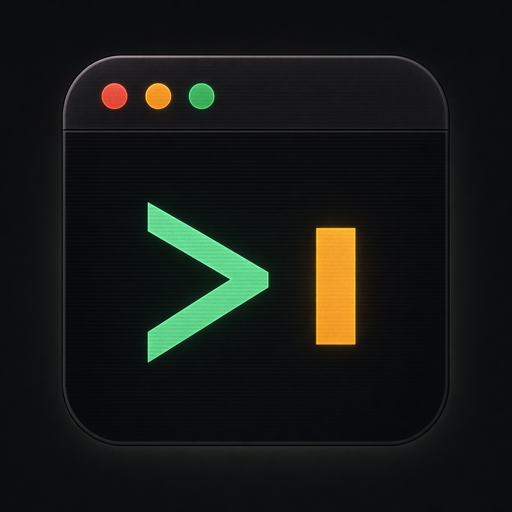

<div align="center">
  

# promptrc

A terminal-inspired prompt library for storing, searching, and reusing your
best AI prompts — keyboard-first, local-first, and completely yours.

[](https://github.com/AdiRishi/promptrc/actions/workflows/ci.yml)  [](https://github.com/AdiRishi/promptrc/pulls)

[**promptrc.app**](https://promptrc.app)

</div>

---

## ✨ Features

- ⌨️ **Keyboard-First Workflow** — Navigate, edit, copy, and delete prompts without ever touching the mouse
- 🔍 **Instant Search** — Fuzzy-match across titles, bodies, categories, and tags as you type
- 🗂️ **Categories & Tags** — Group prompts however you think — by domain, model, project, or mood
- 💾 **Local-First Storage** — Your prompts live in your browser. No accounts, no sync, no servers reading your work
- 🖥️ **Terminal Aesthetic** — A three-pane TUI feel with `~/.promptrc` chrome, monospace type, and traffic-light dots
- 🪶 **Zero Lock-In** — Markdown bodies, plain JSON in `localStorage`, easy to export and walk away with

---

## 🚀 Quick Start

### Prerequisites

- [Node.js](https://nodejs.org/) 22.x or later
- [pnpm](https://pnpm.io/) 10.x or later

### Installation

```bash
# Clone the repository
git clone https://github.com/AdiRishi/promptrc.git
cd promptrc

# Install dependencies
pnpm install

# Start the development server
pnpm dev
```

The app will be available at **http://localhost:8080**

---

## ⌨️ Keyboard Shortcuts

promptrc is designed to feel like a tiny TUI living in your browser. Press <kbd>?</kbd>
at any time to bring up the in-app cheatsheet.

| Keys                        | Action                            |
| --------------------------- | --------------------------------- |
| <kbd>j</kbd> / <kbd>k</kbd> | Next / previous prompt            |
| <kbd>/</kbd>                | Focus the search box              |
| <kbd>n</kbd>                | New prompt                        |
| <kbd>e</kbd>                | Edit the selected prompt          |
| <kbd>d</kbd>                | Duplicate the selected prompt     |
| <kbd>⌘</kbd> + <kbd>C</kbd> | Copy the prompt body to clipboard |
| <kbd>x</kbd>                | Delete (press twice within 3s)    |
| <kbd>⌘</kbd> + <kbd>↵</kbd> | Save the open composer            |
| <kbd>esc</kbd>              | Cancel composer · dismiss overlay |
| <kbd>?</kbd>                | Toggle the help overlay           |

---

## 🧠 How It Works

promptrc is intentionally simple under the hood:

- **Prompts** are stored as plain objects (`id`, `title`, `body`, `category`, `tags`, timestamps, `uses` counter)
- **State** is managed with [Zustand](https://github.com/pmndrs/zustand) and persisted to `localStorage` under the key `promptrc.library.v1`
- **Search** is a synchronous filter over the in-memory list, deferred via `useDeferredValue` so typing stays buttery on large libraries
- **Rendering** happens on the edge — TanStack Start serves SSR HTML from a Cloudflare Worker, then hydrates the React tree on the client

There is no backend, no auth, no telemetry beyond opt-out Google Analytics page views. Clearing your browser storage clears your library — back things up if they matter.

---

## 🛠️ Tech Stack

| Category          | Technology                                                                                    |
| ----------------- | --------------------------------------------------------------------------------------------- |
| **Framework**     | [TanStack Start](https://tanstack.com/start) (React meta-framework)                           |
| **UI Library**    | [React 19](https://react.dev)                                                                 |
| **Build Tool**    | [Vite 8](https://vite.dev)                                                                    |
| **Styling**       | [Tailwind CSS 4](https://tailwindcss.com)                                                     |
| **Components**    | [shadcn/ui](https://ui.shadcn.com) primitives + [Base UI](https://base-ui.com)                |
| **State**         | [Zustand](https://github.com/pmndrs/zustand) with `persist` middleware (localStorage)         |
| **Data Fetching** | [TanStack Query](https://tanstack.com/query) + [TanStack Router](https://tanstack.com/router) |
| **Notifications** | [Sonner](https://sonner.emilkowal.ski)                                                        |
| **Typography**    | [Inter](https://rsms.me/inter/) (Sans) + [JetBrains Mono](https://www.jetbrains.com/lp/mono/) |
| **Icons**         | [Lucide React](https://lucide.dev)                                                            |
| **Testing**       | [Vitest](https://vitest.dev) + [React Testing Library](https://testing-library.com/react)     |
| **Deployment**    | [Cloudflare Workers](https://workers.cloudflare.com) via [Nitro](https://nitro.unjs.io)       |

---

## 🔧 Development

### Available Scripts

| Command               | Description                          |
| --------------------- | ------------------------------------ |
| `pnpm dev`            | Start dev server on port 8080        |
| `pnpm build`          | Build for production                 |
| `pnpm preview`        | Preview the production build locally |
| `pnpm test`           | Run tests with Vitest                |
| `pnpm typecheck`      | Type-check with `tsc --noEmit`       |
| `pnpm lint`           | Run ESLint                           |
| `pnpm format`         | Format with Prettier                 |
| `pnpm check`          | Format + lint --fix in one shot      |
| `pnpm clean`          | Clean build artifacts                |
| `pnpm deploy`         | Deploy to Cloudflare Workers         |
| `pnpm deploy:dry-run` | Validate the deploy without shipping |

### Adding UI Components

This project uses [shadcn/ui](https://ui.shadcn.com). To add a new component:

```bash
npx shadcn@latest add <component-name>
```

### Project Structure

```
src/
├── components/ui/           # shadcn primitives (button, card, kbd, ...)
├── features/
│   └── prompt-library/      # The whole app, isolated as one feature
│       ├── components/      # App shell, tree, workspace, help overlay
│       ├── lib/             # Pure utilities and seed data
│       ├── store/           # Zustand store + tests
│       └── types.ts         # Domain types (PromptRecord, ComposerState, ...)
├── lib/                     # Site-wide config (metadata, URLs)
├── routes/                  # TanStack Router file routes
└── global-styles/           # Tailwind entrypoint and design tokens
```

Everything user-facing lives under `features/prompt-library/`, which keeps the
app cleanly separated from boilerplate (root layout, router config, design
tokens) so the surface area to reason about stays small.

---

## 🌐 Deployment

### Cloudflare Workers

The project is configured for deployment to Cloudflare Workers via Nitro:

```bash
pnpm build
pnpm deploy
```

Use `pnpm deploy:dry-run` to validate the bundle before shipping.

### Other Platforms

Because the app is built with TanStack Start and Nitro, swapping targets is a
config change. Edit `nitro.config.ts` to deploy to Vercel, Netlify, Node, or
any other Nitro-supported preset.

---

## 🎨 Design Philosophy

promptrc is built around three ideas:

- **Your prompts are personal infrastructure.** They should be as fast, unceremonious, and local as a dotfile in `$HOME`.
- **The keyboard is the fastest UI.** Every action you reach for has a single key. The mouse is supported, not required.
- **The terminal vibe is the point.** Monospace type, traffic-light chrome, and a `zsh` prompt header give the app a calm, focused feel — the opposite of a busy SaaS dashboard.

The palette is a warm dark slate with a signature amber primary that nods to terminal cursors and CRT glow.

---

## 🤝 Contributing

Contributions are welcome! Please feel free to submit a Pull Request.

1. Fork the repository
2. Create your feature branch (`git checkout -b feature/amazing-feature`)
3. Commit your changes (`git commit -m 'Add some amazing feature'`)
4. Push to the branch (`git push origin feature/amazing-feature`)
5. Open a Pull Request

Run `pnpm check` and `pnpm test` before opening a PR — CI runs the same checks.

---

## 📄 License

This project is licensed under the MIT License - see the [LICENSE](LICENSE) file for details.

---

<div align="center">
  <sub>Built with ❤️ — type <kbd>?</kbd> to get started</sub>
</div>
