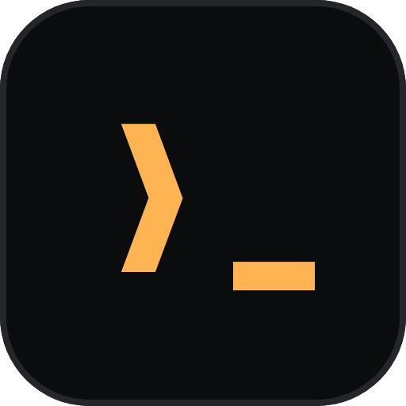
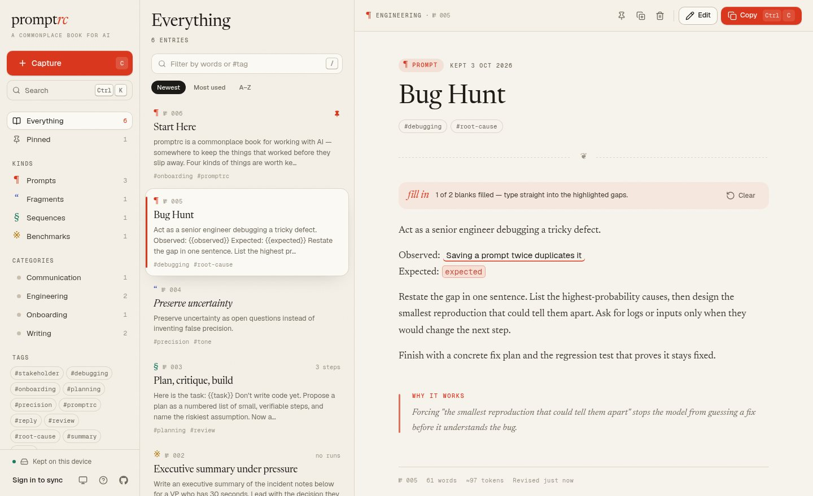
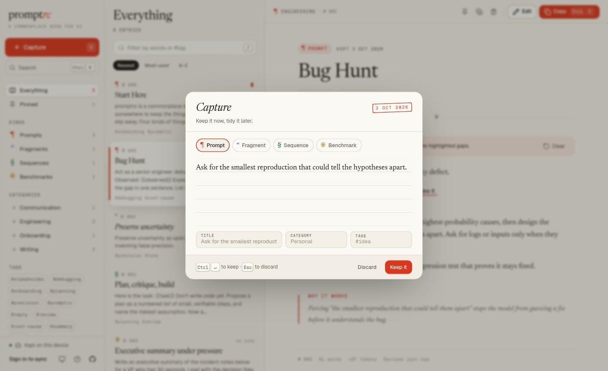
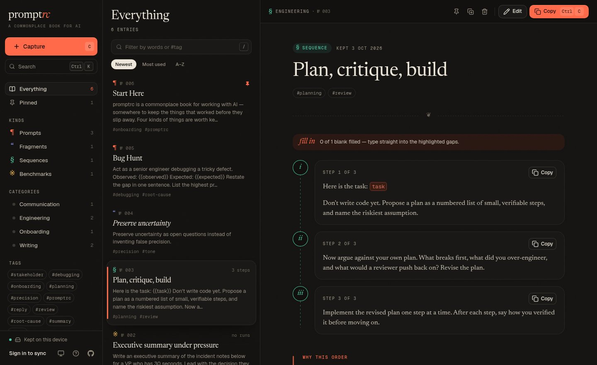

<div align="center">
  

# promptrc

**A commonplace book for working with AI.**
Keep the prompts, phrasings, sequences and benchmarks that worked — before they slip away.

[](https://github.com/AdiRishi/promptrc/actions/workflows/ci.yml) [](https://github.com/AdiRishi/promptrc/actions/workflows/deploy.yml) 

[**promptrc.app**](https://promptrc.app) · [Report a bug](https://github.com/AdiRishi/promptrc/issues)



</div>

---

## What it keeps

A commonplace book was the scholar's notebook of passages worth keeping. promptrc is that, for the moments when working with an AI goes exactly right. Every entry is a **Prompt**, marked by the kind of thing it is:

|     | Kind          | For                               | What the reader gives you                                                |
| --- | ------------- | --------------------------------- | ------------------------------------------------------------------------ |
| ¶   | **Prompt**    | A reusable instruction            | `{{variables}}` become inline fill-in blanks; copy uses your words       |
| “   | **Fragment**  | Wording that landed exactly right | Set as a pull quote, ready to drop into a larger prompt                  |
| §   | **Sequence**  | An ordered chain of instructions  | Numbered steps, each copied on its own, with progress as you go          |
| ※   | **Benchmark** | A reproducible test               | The expected result, a run log per model, verdict stamps and a pass rate |

Every entry can carry **notes** (why it works, what good looks like), a **category**, **tags**, pasted **images**, and a **pin**.

<table>
  <tr>
    <td width="50%"></td>
    <td width="50%"></td>
  </tr>
  <tr>
    <td align="center"><sub>Quick capture — <kbd>c</kbd> from anywhere</sub></td>
    <td align="center"><sub>A sequence, in the darkroom theme</sub></td>
  </tr>
</table>

## Highlights

- **Capture in seconds** — <kbd>c</kbd> opens an index card. Paste, pick a kind, <kbd>⌘</kbd><kbd>↵</kbd>. The title is taken from the first line if you skip it.
- **Fill-in blanks** — write `{{audience}}` or `{{tone | calm}}`; the reader turns them into gaps you type straight into, and remembers what you typed per entry.
- **Command palette** — <kbd>⌘</kbd><kbd>K</kbd> searches every entry and jumps to any kind, category or tag, or runs any command.
- **Keyboard-first** — single letters act on the selection (<kbd>j</kbd>/<kbd>k</kbd>, <kbd>e</kbd>, <kbd>p</kbd>, <kbd>d</kbd>, <kbd>s</kbd>, <kbd>x</kbd> twice); <kbd>?</kbd> shows them all.
- **Local-first, cloud-optional** — everything works signed out (stored in your browser). Sign in to sync to Cloudflare D1 and share read-only links.
- **Paper and darkroom themes** — light, dark, or follow the system, with no flash on load.

## Keys

| Action                         | Keys                                                      |
| ------------------------------ | --------------------------------------------------------- |
| Quick capture                  | <kbd>c</kbd>                                              |
| New, in the full editor        | <kbd>n</kbd>                                              |
| Command palette                | <kbd>⌘</kbd> <kbd>K</kbd>                                 |
| Filter the list                | <kbd>/</kbd>                                              |
| Next · previous                | <kbd>j</kbd> · <kbd>k</kbd> (or arrows in the list)       |
| Copy (with filled blanks)      | <kbd>⌘</kbd> <kbd>C</kbd>                                 |
| Edit · pin · duplicate · share | <kbd>e</kbd> · <kbd>p</kbd> · <kbd>d</kbd> · <kbd>s</kbd> |
| Delete                         | <kbd>x</kbd> twice                                        |
| Save · cancel while editing    | <kbd>⌘</kbd> <kbd>↵</kbd> · <kbd>Esc</kbd>                |
| All keys                       | <kbd>?</kbd>                                              |

---

## Quick start

**Prerequisites:** Node.js (see [`.node-version`](.node-version)), pnpm (pinned in `package.json`), and a [Clerk](https://clerk.com/) project (free tier is fine).

```bash
git clone https://github.com/AdiRishi/promptrc.git
cd promptrc
pnpm install
cp .env.example .env   # add VITE_CLERK_PUBLISHABLE_KEY and CLERK_SECRET_KEY
pnpm db:migrate        # apply D1 migrations locally
pnpm dev               # http://localhost:8080
```

## Tech stack

|               |                                                                                                                                                                                                                      |
| ------------- | -------------------------------------------------------------------------------------------------------------------------------------------------------------------------------------------------------------------- |
| **Framework** | [TanStack Start](https://tanstack.com/start) + [TanStack Router](https://tanstack.com/router) on [React 19.3](https://react.dev) with the [React Compiler](https://react.dev/learn/react-compiler) (native oxc port) |
| **Build**     | [Vite 8](https://vite.dev) (Rolldown) + [Nitro](https://nitro.build) targeting [Cloudflare Workers](https://workers.cloudflare.com)                                                                                  |
| **Data**      | [Cloudflare D1](https://developers.cloudflare.com/d1/) (prompts) + [R2](https://developers.cloudflare.com/r2/) (images); `localStorage` when signed out                                                              |
| **State**     | [Zustand](https://github.com/pmndrs/zustand) (library) + [TanStack Query](https://tanstack.com/query) (server reads)                                                                                                 |
| **Auth**      | [Clerk](https://clerk.com) via `@clerk/tanstack-react-start`                                                                                                                                                         |
| **UI**        | [Tailwind CSS 4](https://tailwindcss.com), [Base UI](https://base-ui.com), [cmdk](https://cmdk.paco.me), [Sonner](https://sonner.emilkowal.ski), [Lucide](https://lucide.dev)                                        |
| **Type**      | [Newsreader](https://fonts.google.com/specimen/Newsreader), [Geist and Geist Mono](https://vercel.com/font)                                                                                                          |
| **Tooling**   | [TypeScript 7](https://devblogs.microsoft.com/typescript/) (native compiler), [Oxlint](https://oxc.rs/docs/guide/usage/linter) (type-aware) and [Oxfmt](https://oxc.rs/docs/guide/usage/formatter)                   |
| **Tests**     | [Vitest 5](https://vitest.dev) — jsdom for UI, [`@cloudflare/vitest-plugin`](https://www.npmjs.com/package/@cloudflare/vitest-plugin) (Miniflare) for D1/R2                                                          |

## Architecture

promptrc is **local-first** with optional cloud sync. One `PromptLibraryClient` sits over two storage adapters, so components never branch on whether you're signed in.

```
 Browser                                                    Cloudflare Worker
┌──────────────────────────────────────────────┐          ┌──────────────────────┐
│  Zustand store ◄──► PromptLibraryClient       │          │ TanStack server fns   │
│  (library, filter,     ├─ local storage  ─────┼─► localStorage                  │
│   selection, composer) └─ remote storage ─────┼─────────►│  D1 (prompts)        │
│                                               │          │  R2 (images)         │
└──────────────────────────────────────────────┘          └──────────────────────┘
```

- Signed-out users get the full app with zero network calls.
- On first sign-in, a library kept in the browser can be copied into the account (see [ADR 0003](docs/adr/0003-copy-local-prompts-on-first-sign-in.md)).
- All four kinds share one record; a sequence's steps live in its body behind an invisible `<!-- step -->` marker (see [ADR 0004](docs/adr/0004-prompt-kinds-share-one-record.md)).

```
src/
├── components/ui/                 # Primitives: button, dialog, input, kbd, choice, toaster
├── features/
│   ├── auth/                      # Sign-in shell + Clerk appearance
│   └── prompt-library/
│       ├── commands/              # Command metadata, keyboard routing, executor
│       ├── components/            # Sidebar, list, reader, editor, capture, palette
│       ├── hooks/                 # Hotkeys, commands, remembered blanks
│       ├── lifecycle/             # Hydration + fresh-library transitions
│       ├── model/                 # Records, kinds, templates, sequences, runs, validation
│       ├── persistence/           # localStorage + D1/R2 adapters
│       ├── rendering/             # Markdown, fill-in blanks, references, formatting
│       ├── selectors/             # Filters, sorts, facets, catalog numbers
│       ├── server/                # TanStack server functions
│       ├── store/                 # Zustand store
│       └── sync/                  # Client + session orchestration
├── lib/                           # Providers, theme, SEO, site config
└── routes/                        # File-based routes
migrations/                        # D1 migrations
tests/                             # Mirrors src/features
```

## Development

| Command          | Description                                          |
| ---------------- | ---------------------------------------------------- |
| `pnpm dev`       | Dev server on port 8080 (runs the Worker in workerd) |
| `pnpm build`     | Production build into `.output/`                     |
| `pnpm test`      | Vitest with coverage (jsdom + workers projects)      |
| `pnpm lint`      | Oxlint, type-aware                                   |
| `pnpm format`    | Oxfmt                                                |
| `pnpm typecheck` | Regenerate Worker types, then TypeScript 7           |
| `pnpm check`     | The CI gate: format, lint, typecheck, deploy dry-run |
| `pnpm deploy`    | Deploy to Cloudflare Workers                         |

### Environment

| Variable                     | Required | Description                               |
| ---------------------------- | -------- | ----------------------------------------- |
| `VITE_CLERK_PUBLISHABLE_KEY` | yes      | Clerk publishable key (client)            |
| `CLERK_SECRET_KEY`           | yes      | Clerk secret key (Worker only)            |
| `VITE_SITE_URL`              | optional | Canonical origin for SEO and social cards |

Only `VITE_*` variables reach the client bundle.

## Deployment

promptrc deploys to Cloudflare Workers with a D1 database (`DB`) and an R2 bucket (`PROMPT_IMAGES`). Migrations in [`migrations/`](migrations) are additive. The Deploy workflow applies them before shipping the Worker; `wrangler deploy` on its own does **not**, so for a manual deploy run:

```bash
pnpx wrangler d1 migrations apply promptrc --remote
pnpm build
pnpm deploy
```

To deploy your own copy: create a D1 database (`pnpx wrangler d1 create <name>`) and an R2 bucket, update the ids and `routes` in `wrangler.jsonc`, and set `CLERK_SECRET_KEY` as a Worker secret (`pnpx wrangler secret put CLERK_SECRET_KEY`).

## Design notes

- **Paper, ink, and one red pencil.** Warm paper or darkroom ink, with vermilion reserved for what matters: the selection, the primary action, the blanks.
- **Printer's marks, not icons.** ¶ “ § ※ say what an entry is in the vocabulary of books.
- **Reading is serif; writing is mono.** Prompts are read in Newsreader and written in Geist Mono, so you always know which mode you're in.
- **Local-first by default.** Useful before you sign in, before you sync, before you trust it.
- **Nothing gets in your way.** Single-letter keys, confirm-by-repeat for delete, toasts instead of dialogs.

## Contributing

Contributions are welcome — please open an issue first for anything beyond a small fix, and run `pnpm check` and `pnpm test` before opening a pull request.

## License

MIT — see [LICENSE](LICENSE).
